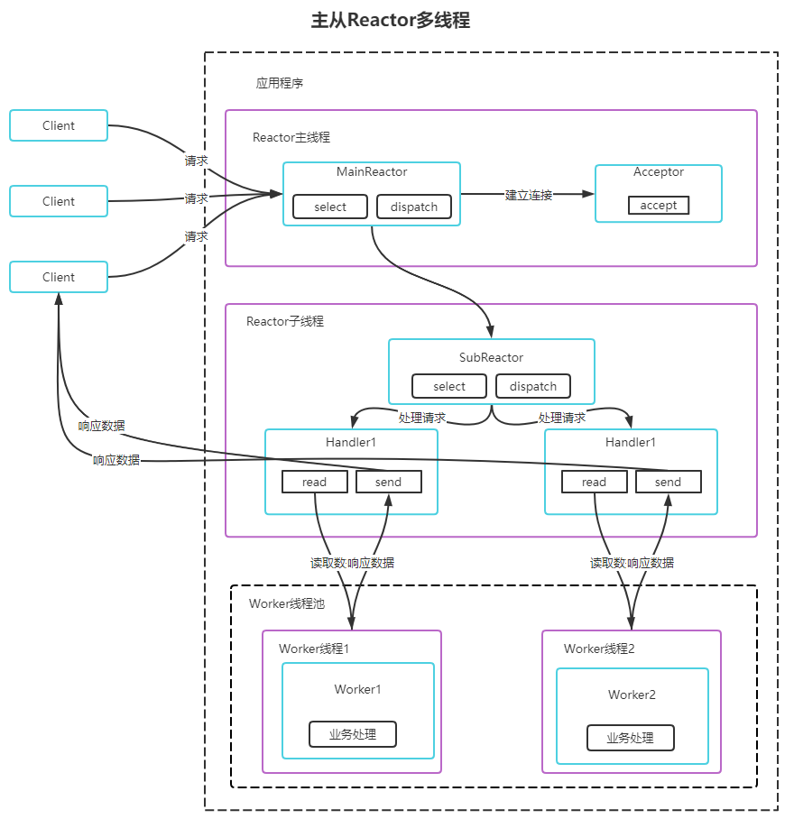

# Netty官方介绍

> Netty is an asynchronous event-driven network application framework
> for rapid development of maintainable high performance protocol servers & clients. 
> Netty是 一个异步事件驱动的网络应用程序框架，用于快速开发可维护的高性能协议服务器和客户端。

# Reactor模式

## 单Reactor单线程模型

### 方案优缺点分析：

1. 有点：模型简单，没有多线程、进程通信、竞争的问题，全部都在一个线程中完成
2. 缺点1：性能问题，只有一个线程，无法完全发挥多核CPU的性能。Handler在处理某个连接上的业务时，整个进程无法处理其他连接事件，很容易导致性能瓶颈
3. 缺点2：可靠性问题，线程意外终止，或者进入死循环，会导致整个系统通信模块不可用，不能接收和处理外部消息，造成节点故障
4. 使用场景：客户端数量有限，业务处理非常快速，比如Redis在业务处理的事件复杂度O(1)的情况

## 单Reactor多线程模型

### 方案说明：

1. Reactor对象通过select监控客户端请求事件，收到事件后，通过dispatch进行分发
2. 如果建立连接请求，则由Acceptor通过accept处理连接请求，然后创建Handler对象处理完成连接后的各种事件
3. 如果不是连接请求，则由Reactor分发到对应的Handler来处理
4. Handler只负责响应事件，不做具体的业务处理，通过read读取数据后，会分发给后面的worker线程的某个线程处理业务
5. Worker线程池会分配独立线程完成真正的业务，并将结果返回给Handler
6. Handler收到响应后，通过send将结果返回给Client

### 方案优缺点分析：

1. 优点：可以充分利用读懂和CPU的处理能力
2. 缺点：多线程数据共享和访问比较复杂，Reactor处理所有的事件的监听和响应，在单线程运行，在高并发场景容易出现性能瓶颈

## 主从Reactor多线程

### 方案说明：
1. Reactor主线程MainReactor对象通过select监听连接事件，收到事件后，通过Acceptor处理连接事件
2. 当Acceptor处理连接事件后，MainReactor将连接分配给SubReactor
3. SubReactor将连接加入到连接队列进行监听，并创建Handler进行各种事件处理
4. 当有新事件发生时，SubReactor就会调用对应的Handler处理
5. Handler通过read读取数据，分发给后面的Worker线程处理
6. Worker线程池分配独立的Worker线程进行业务处理，并返回结果
7. Handler收到响应的结果后，再通过send将结果返回给Client
8. Reactor主线程(本身可以有多个)可以对应多个Reactor子线程，即MainReactor可以关联多个SubReactor

方案优缺点说明：
1. 优点1：父线程与子线程的数据交互简单职责明确，父线程只需要接收新连接，子线程完成后续的业务处理
2. 优点2：父线程与子线程的数据交互简单，Reactor主线程只需要把新连接传给子线程，子线程无需返回数据
3. 缺点：变成复杂度高
结合实例：这种模型在许多项目中广泛使用，包括Nginx主从Reactor多进程模型，Memcached主从多线程，Netty主从多线程模型的支持

## Reactor模式具有如下的优点：
1. 响应快，不必为单个同步时间所阻塞，虽然Reactor本身依然是同步的
2. 可以最大程度的避免复杂的多线程及同步问题，并且避免了多线程/进程的切换开销
3. 扩展性好，可以方便的通过增加Reactor实例个数来从分利用CPU资源
4. 复用性好，Reactor模型本身与具体事件处理逻辑无关，具有很高的复用性

# Netty模型

方案説明：

1. Netty抽象出两组线程池，BossGroup专门负责接收客户端连接，WorkerGroup专门负责网络读写操作。
2. NioEventLoop表示一个不断循环执行处理任务的线程，每个NioEventLoop都有一个Selector，用于监听绑定在其上的Socket网络通道
3. NioEventLoop内部采用串行化设计，从消息的读取->解码->处理->发送，始终由IO线程NioEventLoop负责
   1. NioEventLoopGroup下包含多个NioEventLoop
   2. 每个NioEventLoop中包含一个Selector，一个taskQueue
   3. 每个NioEventLoop的Seletor上可以注册监听多个NioChannel
   4. 每个NioChannel只会绑定在唯一的NioEventLoop上
   5. 每个NioChannel都绑定一个自己的ChannelPipeline

