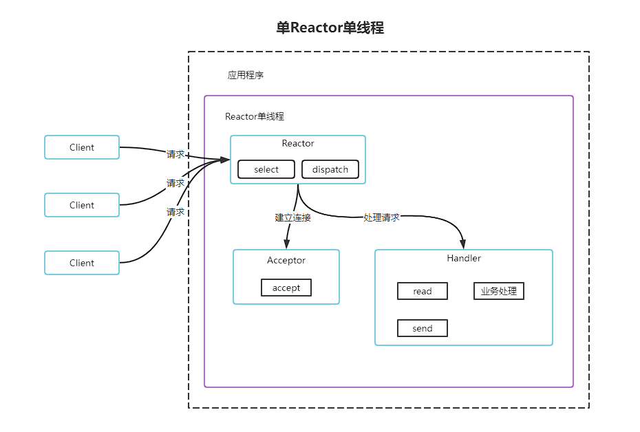

Netty学习案例

## Netty官方介绍

> Netty is an asynchronous event-driven network application framework
> for rapid development of maintainable high performance protocol servers & clients. 
> Netty是 一个异步事件驱动的网络应用程序框架，用于快速开发可维护的高性能协议服务器和客户端。

# Reactor模式

## 单Reactor单线程模型

### 方案优缺点分析：

1. 有点：模型简单，没有多线程、进程通信、竞争的问题，全部都在一个线程中完成
2. 缺点1：性能问题，只有一个线程，无法完全发挥多核CPU的性能。Handler在处理某个连接上的业务时，整个进程无法处理其他连接事件，很容易导致性能瓶颈
3. 缺点2：可靠性问题，线程意外终止，或者进入死循环，会导致整个系统通信模块不可用，不能接收和处理外部消息，造成节点故障
4. 使用场景：客户端数量有限，业务处理非常快速，比如Redis在业务处理的事件复杂度O(1)的情况

## 单Reactor多线程模型

### 方案说明：

1. Reactor对象通过select监控客户端请求事件，收到事件后，通过dispatch进行分发
2. 如果建立连接请求，则由Acceptor通过accept处理连接请求，然后创建Handler对象处理完成连接后的各种事件
3. 如果不是连接请求，则由Reactor分发到对应的Handler来处理
4. Handler只负责响应事件，不做具体的业务处理，通过read读取数据后，会分发给后面的worker线程的某个线程处理业务
5. Worker线程池会分配独立线程完成真正的业务，并将结果返回给Handler
6. Handler收到响应后，通过send将结果返回给Client

### 方案优缺点分析：

1. 优点：可以充分利用读懂和CPU的处理能力
2. 缺点：多线程数据共享和访问比较复杂，Reactor处理所有的事件的监听和响应，在单线程运行，在高并发场景容易出现性能瓶颈

