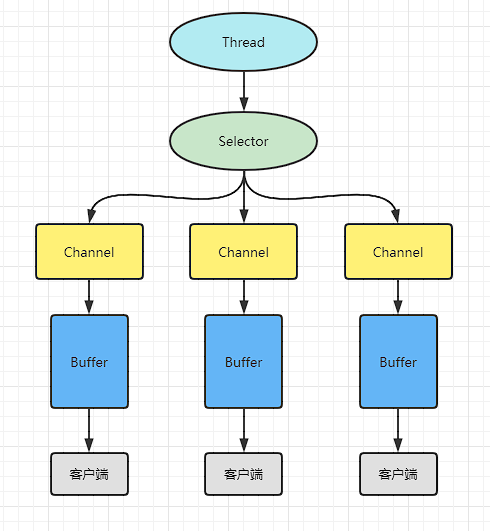

# Selector、Channel和Buffer的关系

1. 每个Channel都会对应一个Buffer
2. Selector对应一个线程，一个线程对应多个Channel
3. 该图反映了有三个Channel注册到了该Selector
4. 程序切换到哪一个Channel是由事件决定的，Event是一个重要的概念
5. Selector会根据不同的事件，在各个通道上切换
6. Buffer就是一个内存块
7. 数据的读取和写入都是通过Buffer操作的。这一点和BIO有区别，BIO要么是输入流，或者是输入流，不能是双向的，但是NIO的Buffer即可以读也可以写，需要通过flip方法切换
8. Channel是双向的，可以返回底层操作系统的情况，比如Linux底层操作系统通道就是双向的